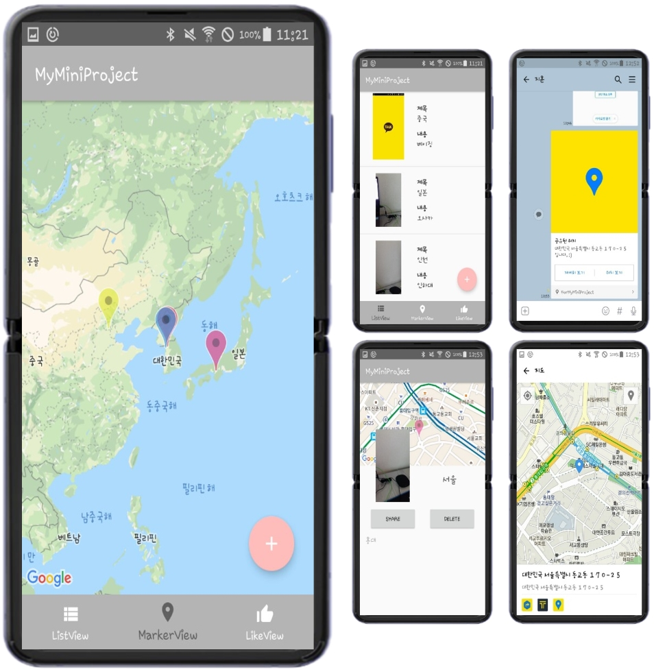
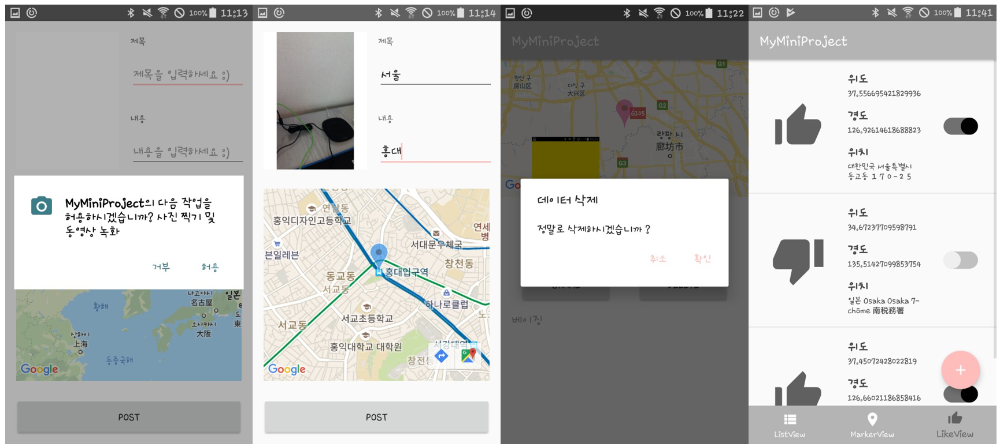

# 👆 프로젝트 요구사항
- Bottom Navigation View, Three Tabs  
  - `List` `GoogleMap` `AnyIdea(using Database)`  
- Floating Action Button(FAB), Insert Item  
  - `Marker` `Title` `Contents` `Image`  
    - Select Image; Camera or Gallery (Full-Size Image, Not Preview)  
- To permanently store the item in the app, Use the mobile database  
- Stored items will be displayed in the list (Tab 1)  
- Stored items will be displayed on the map as a marker (Tab 2)  
- If the item is clicked, Move to the Detail View  
  - In the Detailed View, Share / Delete Function  
    - Share; Marker Location ➡️ Address (using Geocoder)  
    - Share Address using **KaKaoLink Open API**  
    - Delete; Delete Data from Database  
- Make use of the stored data and Configure the Tab 3  
- etc) AlertDialog, Permission, Switch Widget, Toast  

# 👨‍💻 사용 기술 Stack
- [x] Android Studio  
- [x] Java  
- [x] KaKaoLink Open API  

# ⌨️ Code (일부분)
```java  
public class MainActivity extends AppCompatActivity
        implements AdapterView.OnItemClickListener, GoogleMap.OnMarkerClickListener
{
    private int state = 1;

    private BottomNavigationView.OnNavigationItemSelectedListener mOnNavigationItemSelectedListener
            = new BottomNavigationView.OnNavigationItemSelectedListener()
    {
        @Override
        public boolean onNavigationItemSelected(@NonNull MenuItem menuItem) // 밑 하단 Tab의 어떠한 menu가 선택된다면
        {
            switch (menuItem.getItemId())
            {
                case R.id.Menu_First_Tab: // 그 menu가 첫번째 탭이였다면
                    replaceFragment(ListFragment.newInstance()); // 첫번째 탭에 맞는 ListFragment를 출력
                    state = 1; // 현재 상태가 첫번째 탭이었음을 저장
                    return true;
                case R.id.Menu_Second_Tab: // 그 menu가 두번째 탭이였다면
                    replaceFragment(MarkerFragment.newInstance()); // 두번째 탭에 맞는 MarkerFragment를 출력
                    state = 2; // 현재 상태가 두번째 탭이었음을 저장
                    return true;
                case R.id.Menu_Third_Tab: // 그 menu가 세번째 탭이였다면
                    replaceFragment(LikeFragment.newInstance()); // 첫번째 탭에 맞는 LikeFragment를 출력
                    state = 3; // 현재 상태가 세번째 탭이었음을 저장
                    return true;
            }
            return false;
        }
    };
    // 중략...
```  
> MainActivity.java 일부분  

<br/>

```java  
@Override
public void onMapReady(GoogleMap googleMap) // 만약 GoogleMap이 제대로 Loading 되었다면
{
    mMap = googleMap;

    LatLng Seoul = new LatLng(37.541, 126.986);
    mMap.moveCamera(CameraUpdateFactory.newLatLngZoom(Seoul, 4.17f)); // 서울을 기준(중앙)으로 Map이 출력

    mMap.setOnMapClickListener(new GoogleMap.OnMapClickListener()
    {
        @Override
        public void onMapClick(LatLng latLng) // 만약 Map이 클릭된다면
        {
            mMap.clear();

            LatLng ClickLocation = new LatLng(latLng.latitude, latLng.longitude);

            LATITUDE = ClickLocation.latitude;
            LONGITUDE = ClickLocation.longitude;

            mMap.addMarker(new MarkerOptions().position(ClickLocation).draggable(true)
                    .alpha(0.7f).icon(BitmapDescriptorFactory.defaultMarker(BitmapDescriptorFactory.HUE_AZURE)));

            mMap.moveCamera(CameraUpdateFactory.newLatLng(ClickLocation));

            // 그곳의 위도와 경도를 받아 Marker가 표시되며 그곳을 기준(중앙)으로 Map이 출력
            // Marker는 Drag가 되도록 하는 기능을 설정
        }
    });
}
```  
> AddContentActivity.java 일부분  

<br/>

```java  
@Override
public void onClick(View v) // 만약 'Share' 버튼이 눌린다면
{
    AlertDialog.Builder Sharebuilder = new AlertDialog.Builder(DetailContentActivity.this);
    Sharebuilder.setTitle("데이터 공유").setMessage("KaKaoLink를 이용하여 공유하시겠습니까 ?");

    // Dialog 알림이 이러한 제목과 내용으로 출력

    Sharebuilder.setPositiveButton("확인", new DialogInterface.OnClickListener()
    {
        @Override
        public void onClick(DialogInterface dialog, int which) // '확인' 버튼이 눌린다면
        {
            String getAddr = getAddress(templat, templng) ; // Address를 받아와

            LocationTemplate params = LocationTemplate.newBuilder(getAddr,
            // 카카오링크가 실행되어 홈페이지(카카오맵) 상에 Address로 검색하며
                ContentObject.newBuilder("공유된 위치",
                // 카카오톡에서의 보일 제목을 '공유된 위치'로 설정
                "https://tistory2.daumcdn.net/tistory/2247780/skin/images/rectangle.jpg",
                LinkObject.newBuilder()
                    .setWebUrl("https://developers.kakao.com")
                    .setMobileWebUrl("https://developers.kakao.com")
                    .build())
                .setDescrption(getAddr + "입니다. :)").build())
                // 카카오톡에서의 부제목을 설정
            .setAddressTitle(getAddr)
            // 위치 보기에서의 제목을 설정
            .build();

        Map<String, String> serverCallbackArgs = new HashMap<String, String>();

        serverCallbackArgs.put("user_id", "${current_user_id}");
        serverCallbackArgs.put("product_id", "${shared_product_id}");

        KakaoLinkService.getInstance().sendDefault(DetailContentActivity.this, params, serverCallbackArgs, new ResponseCallback<KakaoLinkResponse>()
        {
            @Override
            public void onFailure(ErrorResult errorResult)
            {
                Logger.e(errorResult.toString());
            }

            @Override
            public void onSuccess(KakaoLinkResponse result) // 정상적으로 기능이 실행되었다면
            {
                Toast.makeText(DetailContentActivity.this, "Share, Success", Toast.LENGTH_LONG).show(); // 공유 성공 Toast 알림 출력
            }
        });
    }
});
```  
> DetailContentActivity.java 일부분  

<br/>

```java  
@Override
public void onMapReady(GoogleMap googleMap)
{
    mMap = googleMap;

    LatLng Seoul = new LatLng(37.541, 126.986);

    helper = new MySQLiteOpenHelper(getActivity(), dbName, null, dbVersion);

    // SQLite를 사용하여 "data_information.db"에 Data 저장

    db = helper.getReadableDatabase();

    // Data 읽기기능을 사용할 것이므로 getReadableDatabase로 선언

    Cursor c = db.query(tableName, null, null, null, null, null, null);

    // 'datainfo'의 table에 저장된 Data에 접근

    while (c.moveToNext()) // 처음 Row부터 마지막 Row까지 Data를 확인
    {
        float a = (float) Math.random() * 350;

        Double lat = c.getDouble(3);
        Double lng = c.getDouble(4);

        LatLng AddLocation = new LatLng(lat, lng);

        mMap.addMarker(new MarkerOptions().position(AddLocation)
                    .alpha(0.6f).icon(BitmapDescriptorFactory.defaultMarker(a)));
    }

    c.close();

    // 'datainfo' table 참조 close

    mMap.moveCamera(CameraUpdateFactory.newLatLngZoom(Seoul, 3.29f));

    mMap.setOnMarkerClickListener(new GoogleMap.OnMarkerClickListener() // 만약 Map이 클릭된다면
    {
        @Override
        public boolean onMarkerClick(Marker marker)
        {
            if (mCallback != null)
            {
                mCallback.onMarkerClick(marker);

                // 이벤트 콜백을 만들어 부모 activity와 통신하도록 구현
            }
            return false;
        }
    });
}
```  
> MarkerFragment.java 일부분  

# 💛 프로젝트 결과 사진
</img>
> GoogleMap (Tab 2), List (Tab 1), Share (KaKaoTalk), DetailView, KaKaoMap

<br/>

</img>
> Permission, InsertView, Delete, AlertDialog, List with Switch (Tab 3)
